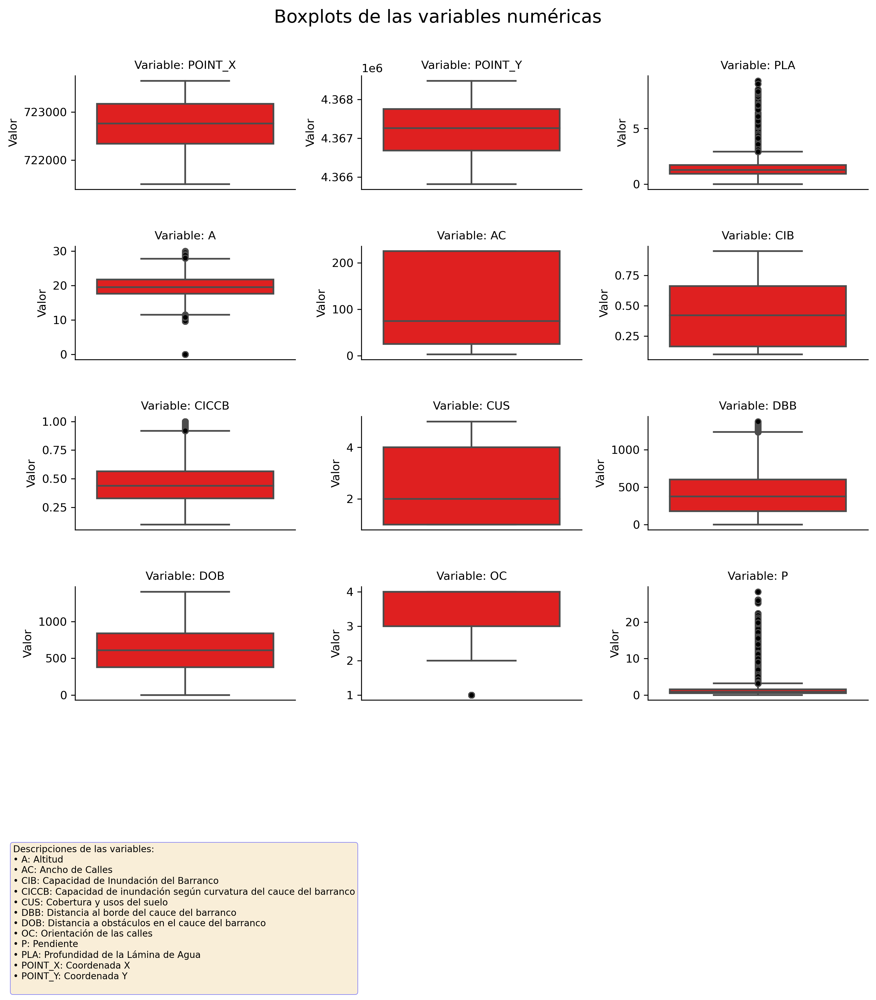

# En Peu
---

## Descripción breve

Este proyecto aplica técnicas de aprendizaje automático para predecir la altura de lámina de agua por inundación a partir de variables geoespaciales y urbanas, como la altitud, pendiente, uso del suelo, orientación de calles o proximidad a barrancos. Se utilizarán modelos como Random Forest, GBM o SVM optimizados mediante selección recursiva de características, análisis de importancia de variables y/o gráficos de dependencia parcial (PDP), con el objetivo de apoyar la prevención de riesgos y la planificación territorial frente a inundaciones.

---

## Ultimas actualizaciones

14/07/2025

Tras observar valores atípicos en los boxplots, se observaron los mapas de las variables A y P, siendo los siguientes.

Mapa con los datos obtenidos de Altitud del terreno:

Mapa con los datos obtenidos de Pendiente del terreno:

Estos datos han sido corregidos, y a continuación se muestran los mapas nuevos para estas variables:

Mapa con los datos obtenidos de Altitud del terreno:

Mapa con los datos obtenidos de Pendiente del terreno:

A partir de estos datos, los nuevos histogramas y boxplots son así:

Y el heatmap que muestra la correlación de variables numéricas es el siguiente:

10/07/2025
Finalizado el análisis exploratorio y generados histogramas y boxplots de todas las variables.

Finalizado el análisis de correlación y generado un heatmap de la correlación entre variables numéricas

Para variables categóricas se hizo el test de Cramer's V, obteniendo una asociación moderada, y para variables categóricas con respecto a variables numéricas se hizo el test de Kruskall Wallis, que indicó que todas las variables tienen una asociación significativa entre ellas.

## Herramientas necesarias

(esto es si se hiciera con R. actualizaré a medida que vaya utilizando más Python)

R (versión ≥ 4.2)

RStudio

Paquetes de R:

tidyverse

caret

randomForest

gbm

pdp

ggplot2

dplyr

Visualizador de datos geoespaciales (QGIS recomendado para análisis paralelo)

Git y GitHub para control de versiones

---

## Objetivos específicos

* Predecir la altura de lámina de agua (PLA) en eventos de inundación mediante modelos de aprendizaje automático.

* Identificar las variables geoespaciales y urbanas más relevantes para dicha predicción.

* Facilitar la interpretación de resultados para su uso en prevención de riesgos e intervenciones urbanísticas.

---

## Procesos y metodologías utilizadas

* Preprocesamiento de datos: normalización de variables numéricas, recodificación de variables categóricas.

* Modelado: entrenamiento de modelos como Random Forest, GBM o SVM con validación cruzada.

* Análisis de importancia de variables.

* Tratamiento de outliers: identificación de valores atípicos en variables como la pendiente (P).

* Visualización: generación de gráficos con ggplot2 para interpretar relaciones clave.

* Documentación del análisis en formato reproducible.

---

## Recursos disponibles para el proyecto

Conjunto de datos geoespaciales estructurados con variables urbanas y naturales.

Scripts de R con funciones reproducibles para cada etapa del análisis.

Visualizaciones generadas para el análisis exploratorio y explicativo.

Resultados de modelos guardados para comparación y replicabilidad.

Soporte bibliográfico en predicción de inundaciones.