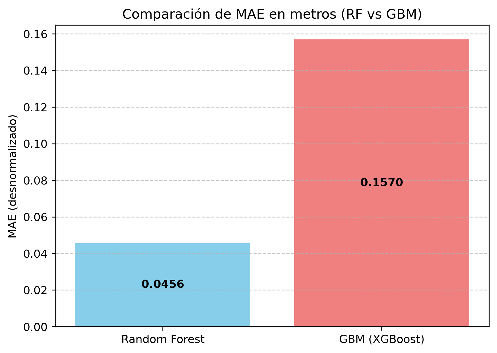
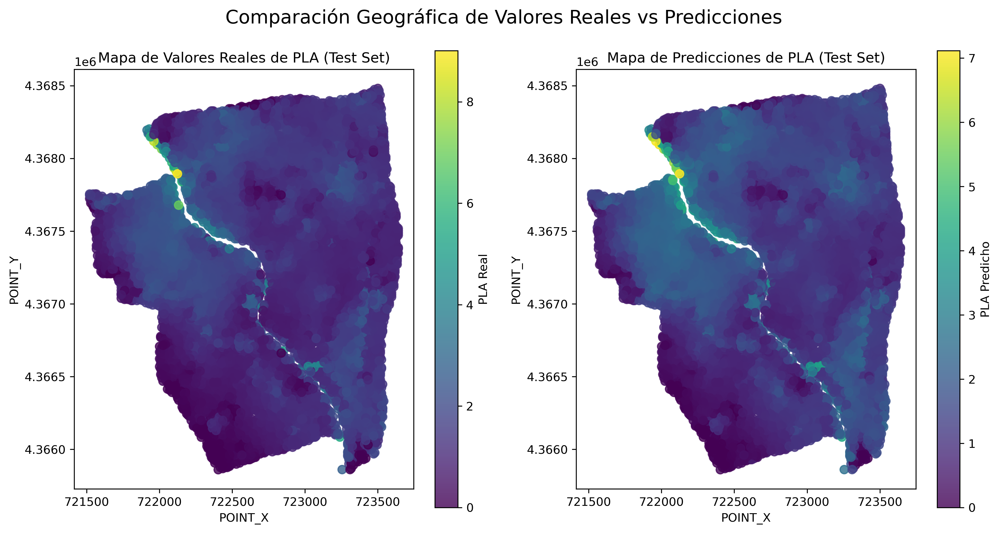

# Project Updates

This file will be used to document the updates of the project.

---

## Ultimas actualizaciones

**18/07/2025**

Se han entrenado dos modelos de machine learning, Gradient Boosting (con XGBoost) y Random Forest, para predecir la profundidad de la lámina de agua (PLA). Los modelos fueron evaluados y comparados, y se generaron las siguientes visualizaciones:

- Comparación de métricas R2, RMSE y MAE entre los modelos:
  
  
  

- Mapa de las predicciones del modelo Random Forest en comparación con los valores reales:
  

- Mapa del error absoluto de las predicciones:
  

El modelo Random Forest mostró un rendimiento superior y fue guardado para futuras predicciones.

---

**17/07/2025**

Se transformaron los datos para prepararlos para el modelado. Las variables numéricas fueron escaladas utilizando `MinMaxScaler` de `sklearn` y las variables categóricas (`CUS` y `OC`) fueron codificadas con `OneHotEncoder` de `sklearn` . El conjunto de datos transformado se guardó como `data_fin.csv`.

---

**14/07/2025**

Tras observar valores atípicos en los boxplots, se observaron los mapas de las variables A y P, siendo los siguientes.

Mapa con los datos obtenidos de Altitud del terreno:

Mapa con los datos obtenidos de Pendiente del terreno:

Estos datos han sido corregidos, y a continuación se muestran los mapas nuevos para estas variables:

Mapa con los datos obtenidos de Altitud del terreno:

Mapa con los datos obtenidos de Pendiente del terreno:

A partir de estos datos, los nuevos histogramas y boxplots son así:

Y el heatmap que muestra la correlación de variables numéricas es el siguiente:

**10/07/2025**

Se llevó a cabo un análisis exploratorio de los datos. Se generaron histogramas y boxplots para visualizar la distribución de las variables numéricas e identificar valores atípicos.

- Histogramas de las variables:

- Boxplots de las variables:

Se realizó un análisis de correlación entre las variables. Se generó un heatmap para visualizar la correlación entre las variables numéricas, y se realizaron tests de Cramer's V y Kruskal-Wallis para analizar la asociación entre variables categóricas y entre variables categóricas y numéricas.

- Heatmap de correlación:

Para variables categóricas se hizo el test de Cramer's V, obteniendo una asociación moderada, y para variables categóricas con respecto a variables numéricas se hizo el test de Kruskall Wallis, que indicó que todas las variables tienen una asociación significativa entre ellas.

**1-10/07/2025**

Se realizó la limpieza de los datos. Se eliminaron filas y columnas innecesarias, se transformaron variables categóricas a numéricas y se guardó el conjunto de datos limpio como `data_stored.csv`.
